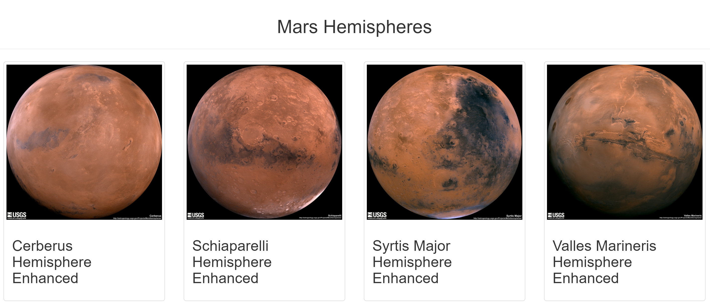
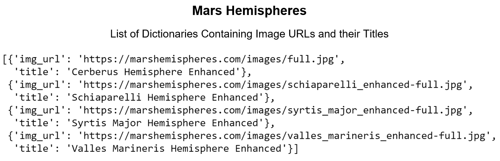

# Mission-to-Mars

  

## Table of Contents
* [Overview](https://github.com/rkaysen63/Mission-to-Mars/blob/master/README.md#overview)
* [Resources](https://github.com/rkaysen63/Mission-to-Mars/blob/master/README.md#resources)
* [Results](https://github.com/rkaysen63/Mission-to-Mars/blob/master/README.md#results)
* [Summary](https://github.com/rkaysen63/Mission-to-Mars/blob/master/README.md#summary)

## Overview:

This project is a web-page designed to scrape data and images about "The Red Planet", Mars, from NASA and JPL at the click of a button.  The data is stored in a local database using MongoDB.

## Resources

* Websites Scraped:
  * https://data-class-mars.s3.amazonaws.com/Mars
  * https://data-class-jpl-space.s3.amazonaws.com/JPL_Space
  * https://data-class-mars-facts.s3.amazonaws.com/Mars_Facts
  * https://marshemispheres.com
* Tools: 
  * Python 3.7.9 in Jupyter Notebook interface
  * HTML
  * Splinter
  * Flask
  * MongoDB
* Lesson Plan: UTA-VIRT-DATA-PT-02-2021-U-B-TTH, Module 10 Challenge

## Results:

* **Mars Hemispheres:** List of Dictionaries containing image URLs and image titles

  

    # Import Splinter and BeautifulSoup
    from splinter import Browser
    from bs4 import BeautifulSoup as soup
    from webdriver_manager.chrome import ChromeDriverManager
    import pandas as pd

    # Set up Splinter
    executable_path = {'executable_path': ChromeDriverManager().install()}
    browser = Browser('chrome', **executable_path, headless=False)

    # Scrape High-Resolution Mars’ Hemisphere Images and Titles

    # Visit the URL 
    url = 'https://marshemispheres.com/'
    browser.visit(url)

    # List to hold the images and titles, i.e. list of "hemispheres" (see for loop).
    hemisphere_image_urls = []

    # Parse home page.
    html = browser.html
    results = soup(html, 'html.parser')

    # Check browser
    # print(browser.html)

    # Retrieve the image urls and titles for each hemisphere.
    for x in range(0, 4):
    
        # Empty dictionary to hold the key:value pairs.
        hemispheres = {}
   
        # Click on each hemisphere link.
        page = browser.find_by_css('.thumb')[x]

        # Navigate to the full-resolution image page.
        page.click()
    
        # Parse new page.
        html = browser.html
        results = soup(html, 'html.parser')       

        # Retrieve the full-resolution title and image URL string for the hemispher image.

        parent_elem = results.find('li')
        link = parent_elem.find('a', target='_blank')['href']
        img_url = ('https://marshemispheres.com/' + link)
    
        # print(link)
        # print(img_url)
    
        title = results.find('h2', class_='title').text
        # print(title)
    
        # Save the full-resolution image URL string as the value for the img_url key. 
        # Save the hemisphere image title as the value for the title key
        hemispheres['img_url'] = img_url
        hemispheres['title'] = title
    
        hemisphere_image_urls.append(hemispheres)

        # Navigate back to the beginning to get the next hemisphere image.
        browser.back()
    
    # Print the list that holds the dictionary of each image url and title.
    hemisphere_image_urls

    # Quit the browser
    browser.quit()

[Back to the Table of Contents](https://github.com/rkaysen63/Mission-to-Mars/blob/master/README.md#table-of-contents)
