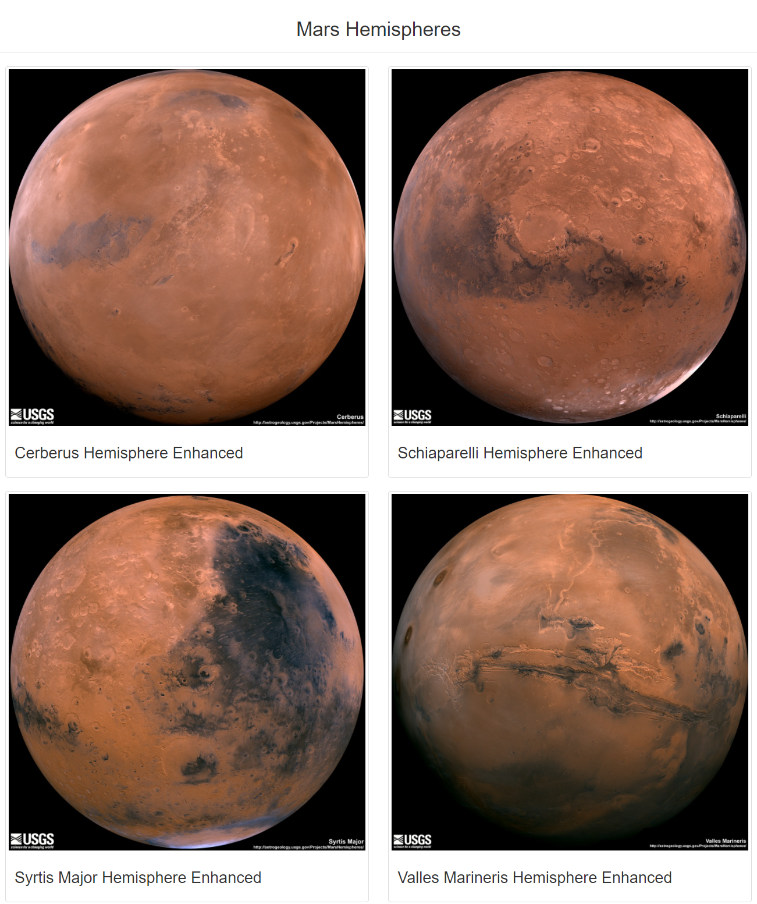
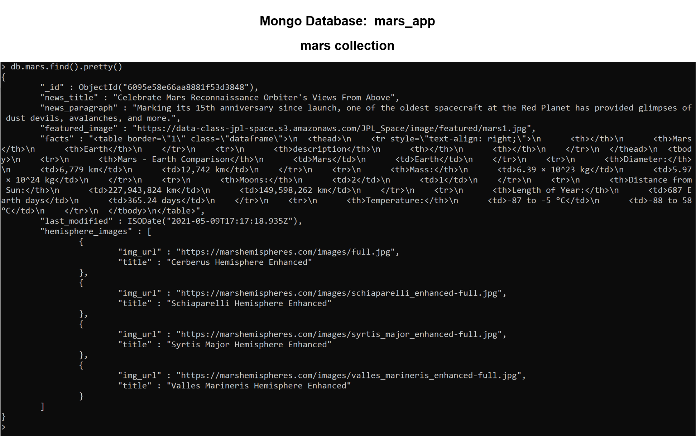
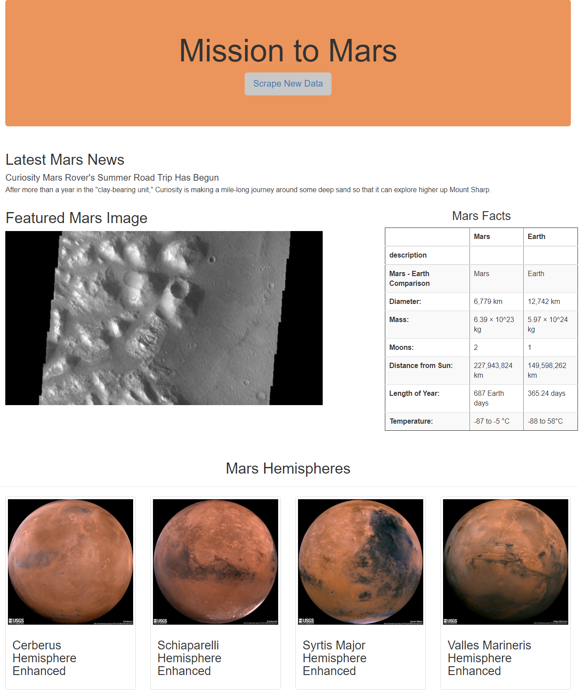

# Mission-to-Mars

  

## Table of Contents
* [Overview](https://github.com/rkaysen63/Mission-to-Mars/blob/master/README.md#overview)
* [Resources](https://github.com/rkaysen63/Mission-to-Mars/blob/master/README.md#resources)
* [Results](https://github.com/rkaysen63/Mission-to-Mars/blob/master/README.md#results)

## Overview:

This project is a web-page designed to scrape data and images about "The Red Planet", Mars, from NASA and JPL at the click of a button.  The data is stored in a local database using MongoDB.

## Resources

* Websites Scraped:
  * https://redplanetscience.com/
  * https://spaceimages-mars.com/
  * https://galaxyfacts-mars.com
  * https://marshemispheres.com
* Tools: 
  * Python 3.7.9 in Jupyter Notebook interface
  * HTML
  * Splinter
  * Flask
  * MongoDB
* Lesson Plan: UTA-VIRT-DATA-PT-02-2021-U-B-TTH, Module 10 Challenge

## Results:

### Mars Hemispheres: List of Dictionaries Containing Image URLs and their Titles

  

    # Import Splinter and BeautifulSoup
    from splinter import Browser
    from bs4 import BeautifulSoup as soup
    from webdriver_manager.chrome import ChromeDriverManager
    import pandas as pd

    # Set up Splinter
    executable_path = {'executable_path': ChromeDriverManager().install()}
    browser = Browser('chrome', **executable_path, headless=False)

    # Scrape High-Resolution Mars’ Hemisphere Images and Titles

    # Visit the URL 
    url = 'https://marshemispheres.com/'
    browser.visit(url)

    # List to hold the images and titles, i.e. list of "hemispheres" (see for loop).
    hemisphere_image_urls = []

    # Parse home page.
    html = browser.html
    results = soup(html, 'html.parser')

    # Check browser
    # print(browser.html)

    # Retrieve the image urls and titles for each hemisphere.
    for x in range(0, 4):
    
        # Empty dictionary to hold the key:value pairs.
        hemispheres = {}
   
        # Click on each hemisphere link.
        page = browser.find_by_css('.thumb')[x]

        # Navigate to the full-resolution image page.
        page.click()
    
        # Parse new page.
        html = browser.html
        results = soup(html, 'html.parser')       

        # Retrieve the full-resolution title and image URL string for the hemispher image.

        parent_elem = results.find('li')
        link = parent_elem.find('a', target='_blank')['href']
        img_url = ('https://marshemispheres.com/' + link)
    
        # print(link)
        # print(img_url)
    
        title = results.find('h2', class_='title').text
        # print(title)
    
        # Save the full-resolution image URL string as the value for the img_url key. 
        # Save the hemisphere image title as the value for the title key
        hemispheres['img_url'] = img_url
        hemispheres['title'] = title
    
        hemisphere_image_urls.append(hemispheres)

        # Navigate back to the beginning to get the next hemisphere image.
        browser.back()
    
    # Print the list that holds the dictionary of each image url and title.
    hemisphere_image_urls

    # Quit the browser
    browser.quit()

### Mars Hemispheres: Function `def mars_hemispheres(browser):`

* Function added to `scraping.py` to retrieve the full-resolution image URL and title for each Martian hemisphere image.

  

    # Function to scrape Mars Images
    def mars_hemispheres(browser):

        # Visit Mars Hemispheres site
        url = 'https://marshemispheres.com/'
        browser.visit(url)

        # Create a list to hold the dictionaries of image_urls and titles
        hemisphere_image_urls = []

        # Parse home page.
        html = browser.html
        results = soup(html, 'html.parser')

        # Retrieve the image urls and titles for each hemisphere.
        try:
            for x in range(0, 4):
    
                # Create an empty dictionary to hold the key:value pairs.
               hemispheres = {}
   
                # Click on each hemisphere link.
                page = browser.find_by_css('.thumb')[x]

                # Navigate to the full-resolution image page.
                page.click()
    
                # Parse new page.
                html = browser.html
                results = soup(html, 'html.parser')       

                # Retrieve the full-resolution title and image URL string for the hemispher image.
                parent_elem = results.find('li')
                link = parent_elem.find('a', target='_blank')['href']
                img_url = ('https://marshemispheres.com/' + link)
    
                title = results.find('h2', class_='title').text
    
                # Save the full-resolution image URL string as the value for the img_url key. 
                # Save the hemisphere image title as the value for the title key
                hemispheres['img_url'] = img_url
                hemispheres['title'] = title
    
                hemisphere_image_urls.append(hemispheres)

                # Use browser.back() to navigate back to the beginning to get the next hemisphere image.
                browser.back()
        except:
            # print('Error in Mars Hemispheres')
            raise

        print(hemisphere_image_urls)

        return hemisphere_image_urls
    
 * **HTML** Code to Display Mars Hemispheres on Webpage:
   
      <!-- Section for Mars Hemispheres -->
      

        

          <h2 class="text-center">Mars Hemispheres</h2>
        

        
        

          

            
            

              <h3>{{hemisphere.title}}</h3>
            

          

        

        
      

    
    
* **Mongo database:** 
 mars_app, collection: mars

  

  The Mongo database that holds the "mars" collection is called "mars-app".  Code to check for updates:

    (PythonData) PS C:\Users\kayse\OneDrive\Documents\GitHub\Mission-to-Mars> mongo
    (PythonData) PS C:\Users\kayse\OneDrive\Documents\GitHub\Mission-to-Mars> db.mars.find().pretty()
    
### Mobile Ready and Web Page Customization

  

* The webpage is responsive and mobile ready due to Bootstrap 4's grid system.
* The Jumbotron background color was changed to rust and the botton color changed to grey.

      <!-- Add Jumbotron to Header -->
      

        <h1>Mission to Mars</h1>
        <!-- Add a button to activate scraping script -->
        
<a class="btn btn-lg" style="background-color: rgb(202, 199, 199)" 
          href="/scrape" role="button">Scrape New Data</a>

      

* "Mars Facts" was centered above the table.

        <!-- Mars Facts -->
        

          <h3 class="text-center">Mars Facts</h3>
          {{ mars.facts | safe }}
        

* Using the Bootstrap 4 grid system, the four Mars hemisphere thumbnails were displayed in a single row.  See opening image above the Table of Contents.
  
        
        

[Back to the Table of Contents](https://github.com/rkaysen63/Mission-to-Mars/blob/master/README.md#table-of-contents)
